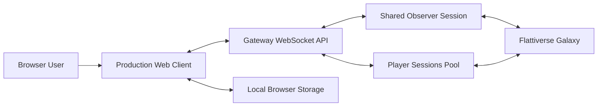
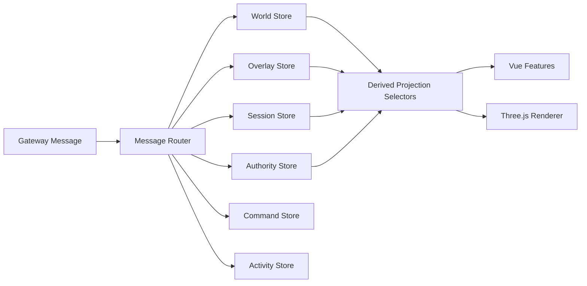
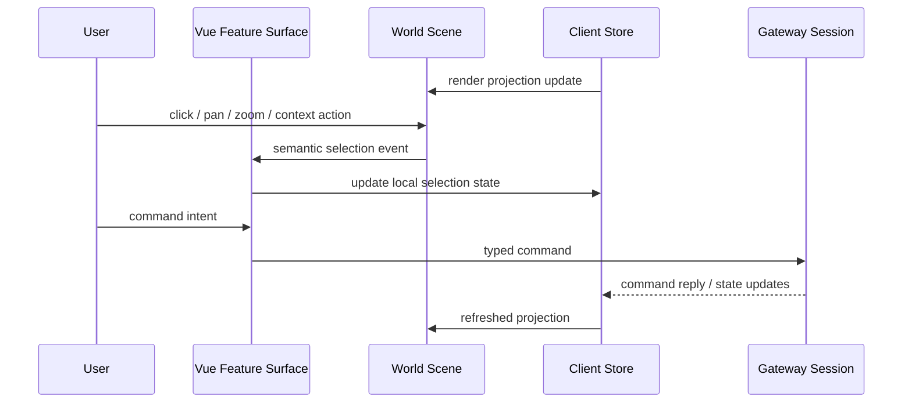
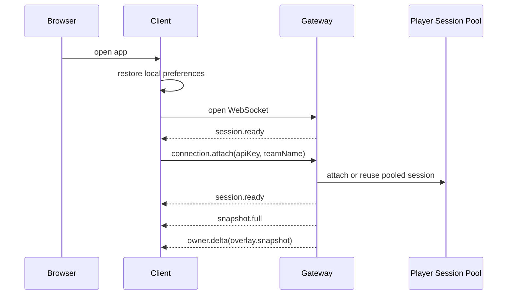
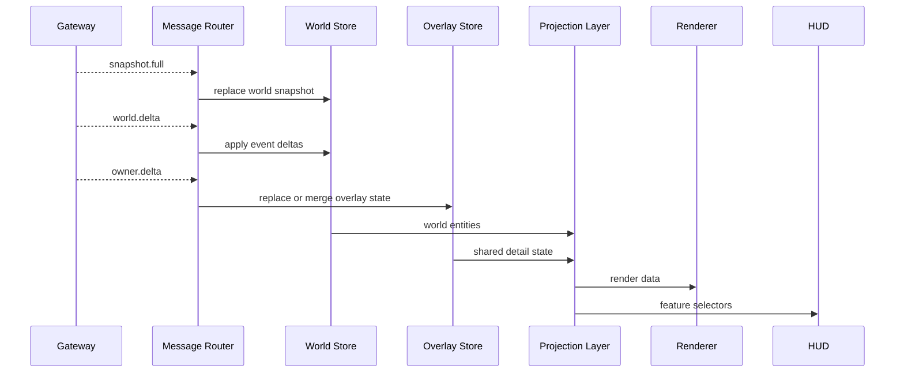
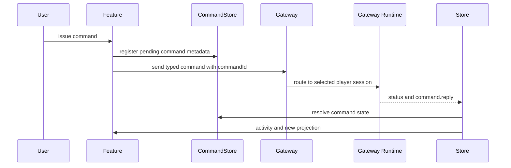

# Flattiverse Production Client Architecture

## Purpose

This document defines how the production Flattiverse client should be structured.

For the detailed gateway-to-web client protocol, message catalog, and sequencing rules, see `docs/gateway-webui-communication.md`.

It is intentionally written as a build document, not a feature pitch. The goal is to define:

- the major client systems
- the boundary between browser client, gateway, and upstream Flattiverse runtime
- the flow of snapshots, deltas, overlays, commands, and UI events
- the architectural decisions that shape the client
- the constraints that matter before the client scales further

## Scope

This architecture covers the browser-facing production client under `gui` and its direct integration with the ASP.NET Core gateway under `backend/Gateway`.

It does not define:

- launcher or patching concerns
- account management outside gateway session attach/select flows
- full backend deployment architecture
- every future gameplay surface

## Executive Summary

The production client should use a clear split between the major responsibilities in the stack:

- Vue owns application composition, workflows, and HUD surfaces.
- A dedicated realtime state layer owns protocol ingestion and state reduction.
- Three.js owns world rendering and direct spatial interaction.
- The gateway remains the only browser transport boundary.

The production client should avoid collapsing transport, reducers, domain state, command handling, and UI orchestration into a single root component.

The target architecture is therefore:

- transport layer for WebSocket session lifecycle and protocol framing
- client domain store for shared world, shared detail overlays, control authority, command state, activity feed, and UI state
- rendering engine that consumes a prepared world projection instead of raw component props
- feature modules that bind user intent to typed commands and selectors
- generated contract layer that stays aligned with the gateway DTOs

## Protocol Terminology

This document refers to gateway message names such as `session.ready`, `snapshot.full`, `world.delta`, `owner.delta`, and `overlay.snapshot`.

- These names are part of the current browser-facing gateway contract.
- They are included here so the architecture can describe concrete flows precisely.
- They should be understood as protocol terms, not as references to any earlier frontend implementation.

## System Context

### Boundary Summary

- The browser does not speak the connector protocol directly.
- The gateway is the single translation and session-management boundary.
- Informational gameplay state should be shared broadly across connected users unless it contains secrets or account credentials.
- Control authority must remain scoped to the attached player session that owns it.
- Browser-local persistence is limited to client preferences and low-risk cached metadata.

## Architectural Goals

- Share gameplay information broadly between users when that information is needed for play, coordination, or situational awareness.
- Preserve strict separation between information visibility and control authority.
- Keep realtime rendering outside Vue's fine-grained component churn.
- Make protocol ingestion deterministic and replayable.
- Make player switching a local subscription change, not a reconnect workflow.
- Keep the gateway contract stable and intentionally smaller than connector internals.
- Support multiple simultaneous browser clients against the same gateway.
- Allow the client to grow from an initial gameplay shell to a full gameplay surface without central-file collapse.

## Non-Goals

- Mirroring every connector type into the browser.
- Treating the browser as a trusted automation client.
- Building all gameplay logic into the frontend.

## Core Domain Model

The client deals with five different categories of state. The production architecture should model them explicitly.

### 1. Public World State

This is shared state visible to any observing client:

- galaxy metadata
- teams
- clusters
- public units
- public controllables summary
- public chat stream

Source:

- `session.ready`
- `snapshot.full`
- `world.delta`
- `chat.received`

Characteristics:

- cacheable in memory
- suitable for rendering and general HUD views
- not sufficient for issuing player-specific commands safely

### 2. Shared Detail Overlay State

This is higher-detail gameplay state layered on top of the shared world model:

- exact controllable runtime state
- subsystem state
- movement state
- battery, shield, hull, ammo and navigation details
- higher-fidelity coordinates and runtime telemetry when that information is meant to be visible to collaborating users

Source:

- detail streams derived from the gateway contract; the current contract uses `owner.delta` messages and `overlay.snapshot` events for this stream

Characteristics:

- should be distributed to all relevant users when it is informational rather than permission-bearing
- must be treated as authoritative for detail-level presentation
- should replace prior overlay state when an `overlay.snapshot` event is received

### 3. Control Authority State

This is the authority model that determines who is allowed to issue commands:

- attached player sessions
- currently selected player session
- controllables the active user is allowed to command
- command affordances that should be enabled or disabled in the UI
- any authority-scoped identifiers required for routing commands correctly

Source:

- `session.ready`
- attach, detach, and player-select flows
- gateway-side authority and session routing rules

Characteristics:

- user-scoped
- must never be inferred from shared informational state alone
- must gate all outgoing control actions

### 4. Command Lifecycle State

This is not world state. It is operational state for asynchronous user intent:

- pending command IDs
- command labels and subjects
- accept/completion/rejection status
- command error details

Source:

- local dispatch metadata
- `command.reply`
- `status`

Characteristics:

- ephemeral
- used for UX feedback, not scene truth
- should remain separate from domain entities

### 5. UI and Workflow State

This is purely client-local state:

- popup visibility
- selected tabs and panels
- camera preferences
- selected player and selected controllable
- recent activity history visibility
- local saved connection presets

Characteristics:

- does not belong in transport reducers
- can be persisted selectively
- should not contaminate world reducers

## Production Client Subsystems

## 1. Transport and Session Layer

Responsibilities:

- own the WebSocket lifecycle
- expose connection state changes
- serialize typed outgoing gateway messages
- parse typed incoming gateway messages
- handle heartbeat behavior
- surface reconnect and fatal-session states consistently

Production target:

- keep a thin socket adapter
- add a higher-level gateway session service above it
- centralize reconnect policy, backoff policy, heartbeat timeouts, and attach replay rules there

Recommended structure:

- `src/transport/socket/` for raw transport
- `src/transport/gateway/` for protocol client behavior
- `src/transport/contracts/` for generated or wrapped contract types

## 2. Realtime State Store

Responsibilities:

- reduce gateway messages into client state
- maintain normalized shared-world, shared-detail, and authority projections
- expose selectors for feature modules and renderer consumption
- preserve determinism between full snapshot replacement and delta application

Production target:

- move all gateway message reduction into dedicated store modules
- normalize entities by ID instead of repeatedly scanning arrays in view code
- expose denormalized selectors for UI and rendering
- keep raw contract DTOs at the boundary and map them into client domain types

Recommended internal slices:

- `sessionStore`
- `worldStore`
- `overlayStore`
- `authorityStore`
- `commandStore`
- `activityStore`
- `uiStore`

### State Flow

## 3. Projection and Selector Layer

Responsibilities:

- merge shared world, shared detail overlays, and current authority scope into a feature-friendly model
- expose renderable units, selected-controllable projection, metrics cards, interaction targets, and command eligibility
- keep expensive derivations out of Vue templates

Production target:

- define selectors as pure functions over the store
- share selectors between HUD features and renderer input preparation
- avoid duplicate public-to-owner reconciliation code in multiple places
- keep visibility rules separate from authority rules in selector logic

## 4. Render Engine

Responsibilities:

- render the world projection efficiently
- control camera, zoom, pan, focus, and picking
- translate spatial input into semantic interaction events
- remain independent from Vue component lifecycle except for mount and dispose boundaries

Production target:

- keep rendering as a dedicated imperative subsystem
- feed it prepared immutable render inputs instead of raw gateway DTOs when practical
- split rendering internals into smaller modules: camera, picking, geometry/material systems, entity mapping, decorations, and diagnostics

Recommended render submodules:

- `scene/WorldSceneController`
- `scene/WorldSceneMapper`
- `scene/camera/`
- `scene/picking/`
- `scene/materials/`
- `scene/overlays/`

### Renderer Interaction Model

## 5. Feature Modules and HUD Surfaces

Responsibilities:

- isolate UX flows by feature area
- bind selectors to presentational components
- translate user intent into typed command calls

Target feature slices:

- connection and session management
- player selection and control authority context
- world viewport shell
- shared detail panels
- command dock and quick actions
- chat and activity stream
- diagnostics and connection status

Production target:

- each feature owns its components, selectors, and command bindings
- shared primitives live below features, not inside the root shell

## 6. Persistence Layer

Responsibilities:

- persist low-risk client preferences
- restore non-sensitive UX state where appropriate
- version local persisted payloads

Production target:

- persist only what is safe and necessary
- keep raw API key persistence available for reconnect and multi-session workflow continuity
- make persisted credential handling explicit in the client architecture rather than treating it as an incidental implementation detail

Safe persistence candidates:

- gateway URL override
- camera preferences
- preferred HUD layout
- recent non-sensitive connection labels
- UI panel state
- raw player API keys when the client is expected to restore attached-session workflows locally

Unsafe default candidates:

- command history containing sensitive payloads
- authority-scoped overlay snapshots that should not be persisted beyond their intended audience

## 7. Contract Generation and Compatibility Layer

Responsibilities:

- keep browser and gateway DTOs synchronized
- preserve a stable browser contract over backend evolution
- create a narrow adaptation seam if the contract changes

Production target:

- continue generating `src/types/generated.ts` from `Flattiverse.Gateway.Contracts`
- avoid hand-maintained duplicate transport types
- add compatibility tests for contract generation in CI

## 8. Diagnostics and Observability

Responsibilities:

- surface connection state clearly
- expose protocol version and gateway health when useful
- record command failures and important status events
- support debugging without shipping connector-level details into the UI

Production target:

- keep a structured activity/event stream in the client
- add optional debug views for raw message inspection in development only
- distinguish user-facing activity from developer diagnostics

## End-to-End Flows

## Startup and Attach Flow

Key rule:

- attach and selected-player behavior should be replayable after reconnect without reintroducing duplicate local commands.
- attach establishes control authority, not exclusive visibility over shared gameplay information.

## Snapshot and Delta Ingestion Flow

Key rule:

- `overlay.snapshot` is authoritative replacement, not merge-only state.
- informational state should be shared to all appropriate users; command permission remains separate.

## Command Flow

Key rules:

- command IDs exist for UX correlation, not authoritative world truth
- command replies and world updates must be handled independently
- a successful command reply does not replace later state updates from snapshot or overlay streams
- one user must never be able to issue commands through another user's authority scope

## Navigation Flow

Navigation is server-driven.

- The client issues `command.set_navigation_target`.
- The gateway registers and executes the navigation plan server-side through `GatewayNavigationService`.
- The resulting navigation state comes back through the shared detail overlay stream.

That is the correct authority boundary. The production client should keep navigation as a server-owned behavior and only render the plan and its current status.

## Core Decisions

- The gateway is the only browser-facing transport boundary.
- Generated TypeScript types remain sourced from the C# contracts.
- Shared gameplay information stays broadly visible when needed for play and coordination.
- Control authority remains separate from shared information visibility.
- Player switching is treated as a client-side selection flow over already-attached sessions.
- Three.js remains outside Vue entity rendering.
- Asynchronous command correlation uses `commandId`.
- Navigation authority remains server-side.

## Decisions to Avoid

- Do not collapse transport, reducers, selectors, command handling, and UI orchestration into a single root component.
- Do not keep overlay handling at the boundary as `Record<string, unknown>` when typed domain adapters can define the contract clearly.
- Do not rely on repeated array scans where normalized entity indexes and selectors are more appropriate.
- Do not couple UI components directly to raw transport DTOs when richer client domain types are warranted.

## Data Ownership Rules

- The gateway owns protocol truth.
- The client store owns reduced client truth.
- The renderer owns world visualization state only.
- Vue components own presentation and local interaction workflow state.
- Browser persistence owns preferences only, not authoritative gameplay state.

Visibility rule:

- gameplay information that is relevant for shared play should be distributed as shared state, not hidden by default behind per-user boundaries.

Authority rule:

- control permissions stay user-scoped and must be enforced by the gateway even when multiple users can see the same entity state.

These ownership rules matter because most future complexity will come from violating them.

## Failure and Recovery Strategy

The production client should explicitly define behavior for the following cases:

- gateway socket disconnect
- reconnect with attached sessions
- selected player becomes unavailable
- stale overlay after player switch
- command reply arrives after local UI context changed
- public snapshot arrives before detail overlay refresh
- gateway protocol version drift

Expected behaviors:

- preserve UI shell and diagnostics on disconnect
- clear and rebuild authority-scoped detail state when player context changes
- treat reconnect as session recovery, not full browser reset
- keep pending commands time-bounded and visibly unresolved if the connection drops
- expose protocol mismatch or unsupported message cases clearly in diagnostics
- preserve shared informational visibility while recomputing control authority after reconnect

## Performance Constraints

The production client has a few explicit performance constraints:

- World rendering must handle large object counts without one-component-per-entity rendering.
- Store updates must minimize full-array rescans where entity counts are high.
- Selector outputs for rendering should be incremental or cheaply recomputed.
- Spatial picking should remain renderer-owned.
- High-frequency streams should not cause broad Vue rerender storms.

Production implication:

- normalize store data
- memoize or structurally share selector outputs where it matters
- keep the render loop imperative and isolated

## Security and Trust Notes

- The browser client is not trusted with connector internals.
- The gateway should remain the only place where upstream connector credentials and runtime routing exist.
- Browser persistence of raw player API keys is an explicit client capability and should be handled deliberately in the persistence design.
- Shared informational state and control authority should be treated as different concerns.
- Users may observe the same entity state while still being unable to command the same entities.

## Testing Strategy

The architecture is only useful if it produces testable seams. The production client should support tests at four levels.

### Unit Tests

- world delta reducers
- overlay reducer replacement and merge behavior
- selectors for active authority scope and controllable views
- command lifecycle handling
- formatting and mapping helpers

### Integration Tests

- gateway message stream to store reduction
- reconnect and attach replay behavior
- player switching behavior
- renderer projection mapping from store selectors
- shared visibility with isolated command authority behavior

### Manual Realtime Tests

- two browser clients connected simultaneously
- switching active player in one client without reconnecting upstream
- command routing to the currently selected player only
- overlay replacement on `overlay.snapshot`
- navigation target lifecycle and server-driven completion
- shared information remains visible across users while cross-user control remains blocked

### Performance Checks

- high unit-count render test
- rapid delta ingestion test
- repeated player-switch stress test
- command spam resilience and activity feed behavior

## Open Decisions for Production Planning

- whether to adopt a lightweight explicit store library or keep a custom composition-based store
- whether sensitive remembered credentials should exist at all in the browser
- how much raw protocol inspection tooling should be available in production builds
- whether the client needs route-based deep links or should remain a single-scene application shell
- whether replayable development traces should be captured for state debugging

## Recommended Next Implementation Order

1. Establish transport, reducer, and selector layers as dedicated modules from the start.
2. Introduce a client domain model for public world, shared detail state, and command lifecycle.
3. Introduce an explicit authority model that is separate from shared informational state.
4. Refactor the viewport feature to consume selector output rather than raw root-state props.
5. Split the HUD into feature modules around session management, detail panels, command dock, and activity/chat.
6. Revisit persistence and formalize persisted credential handling, restore behavior, and local UX controls.
7. Add reducer and selector tests before broadening feature scope further.

## Final Position

The production Flattiverse client should be a realtime state-driven application with a strict split between UI composition, protocol ingestion, and world rendering.

The main production task is to formalize the boundaries in the client architecture:

- gateway contract as the only browser backend seam
- explicit stores for world, shared detail overlays, control authority, commands, activity, and UI state
- Three.js as a dedicated renderer, not a component tree substitute
- Vue as the orchestration and HUD layer, not the place where realtime protocol logic accumulates indefinitely